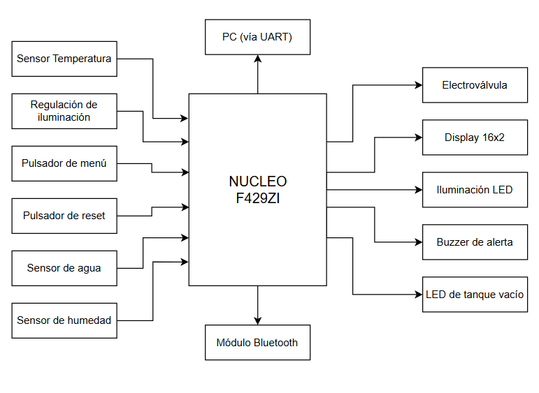

## Definición de Requisitos y Casos de Uso del Trabajo Final introducción a Sistemas Embebidos  
#### Laureano Agustin Wawryczuk

#### 1er Cuatrimestre 2025  

# Monitoreo Electrónico de Invernadero 

## 1 - Marco del proyecto  

Se desea implementar un sistema que interactúe con diferentes sensores y actuadores, empleando interfacez con el usuario y módulos de comunicación para transmisión de datos para ser utilizados en una aplicación real.

## 2 - Selección del proyecto a implementar  

Al momento de la elección del sistema a implementar, se barajaron diferentes opciones acorde a tres aspectos a considerar:  

- **Disponibilidad del hardware**: Los elementos electrónicos utilizados deben estar disponibles en el mercado. 
- **Utilidad del proyecto**: Se desea que el sistema a implementar tenga utilidad directa.
- **Tiempo de implementación**: El proyecto debe ser implementado en los tiempos explicitados a lo largo del cuatrimestre.

<table>
  <tr>
    <th>Proyecto</th>
    <th>Peso </th>
    <th>Disponibilidad del hardware (Peso: 8)</th>
    <th>Utilidad del proyecto (Peso: 7)</th>
    <th>Tiempo de implementación (Peso: 9)</th>
    <th> Suma de puntajes pesados </th>
  </tr>
  <tr>
    <td rowspan="2">Timbre escolar</td>
    <td>Puntaje</td> 
    <td style="text-align: center;">8</td>
    <td style="text-align: center;">7</td>
    <td style="text-align: center;">9</td>
    <td style="text-align: center;" rowspan="2">194</td>
  </tr>
  <tr>
    <td> Puntaje pesado</td>
    <td style="text-align: center;">64</td>
    <td style="text-align: center;">49</td>
    <td style="text-align: center;">81</td>
</tr>
<tr>
    <td rowspan="2">Invernadero automático</td>
    <td>Puntaje</td> 
    <td style="text-align: center;">8</td>
    <td style="text-align: center;">8</td>
    <td style="text-align: center;">9</td>
    <td style="text-align: center;" rowspan="2"> 201 </td>
  </tr>
  <tr>
    <td> Puntaje pesado</td>
    <td style="text-align: center;">64</td>
    <td style="text-align: center;">56</td>
    <td style="text-align: center;">56</td>
</tr>
<tr>
    <td rowspan="2">Monitoreo de alimentación de tableros industriales</td>
    <td>Puntaje</td> 
    <td style="text-align: center;">4</td>
    <td style="text-align: center;">9</td>
    <td style="text-align: center;">4</td>
    <td style="text-align: center;" rowspan="2"> 131 </td>
  </tr>
  <tr>
    <td> Puntaje pesado</td>
    <td style="text-align: center;">32</td>
    <td style="text-align: center;">63</td>
    <td style="text-align: center;">36</td>
    
</tr>
</table>

-Timbre escolar: El proyecto consiste en implementar un timbre automático para aplicación en colegios secundarios donde se tienen horarios de recreos establecidos, automatizando el proceso de tocar el timbre y evitando errores por parte del preceptor. Se le asignó un puntaje de 8 en disponibilidad de hardware, porque los elementos se consiguen fácilmente en cualquier casa de electrónica; un puntaje de 7 en utilidad, dado que puede generar interés a los colegios pero solo a un costo bajo; se le asignó un puntaje de 9 a tiempo de implementación, porque es un proyecto acorde al tiempo estipulado

-Invernadero automático: El proyecto consiste en implementar un sistema que controle y regule los parámetros dentro de un invernadero para abastecer de agua y monitorear el estado de una planta específica, automatizando el proceso rutinario de una persona de regar el suelo. Se le asignó un puntaje de 8 en disponibilidad de hardware, porque los elementos se consiguen fácilmente en cualquier casa de electrónica; un puntaje de 8 en utilidad, dado que a un precio competitivo puede introducirse en el mercado; se le asignó un puntaje de 9 a tiempo de implementación, porque es un proyecto acorde al tiempo estipulado

-Monitoreo de alimentación de tableros industriales: El proyecto consiste en dearrollar un sistema que monitoree la tensión y corriente trifásica, detecte anomalías y envíe alertas a un sistema central para monitoreo y acción sobre un tablero aplicado a la industria. Se le asignó un puntaje de 4 en disponibilidad de hardware, porque los transductores para mediciones de corrientes trifásicas son dificiles de conseguir; un puntaje de 9 en utilidad, dado que puede ser un elemento de gran utilidad para control y análisis estadístico; se le asignó un puntaje de 4 a tiempo de implementación, pues es un proyecto extenso para desarrollar.

### 2.1 - Propósito del proyecto  

Diseñar un sistema que automatice el proceso de riego y control de un invernadero, dependiendo únicamente de la persona cuando sea necesario rellenar el agua del recipiente que riega el suelo. A su vez enviará datos de temperatura, humedad, estado de los periféricos y alertas al usuario.

### 2.2 - Alcance del proyecto  

El sistema será desarrollado utilizando la placa **NUCLEO-F429ZI**, incluyendo las siguientes funcionalidades:  

1. Control de electroválvula de riego monitoreando la humedad de suelo y la disponibilidad de agua en el tanque empleando un sensor N.O. al fondo del tanque que se cerrará si detecta agua.
2. Visualización del estado del sistema en un LCD.  
3. Interacción mediante un menú UART y Bluetooth para ajustar parámetros y verificar el estado del sistema.  
4. Pulsador para cambiar los datos mostrados en el Display.
5. LED de tanque vacío y buzzer de alarma ante ausencias de agua prolongadas.
6. Pulsador para apagar la alarma sonora al tener ausencia de agua.
7. Control de iluminación para independizar al sistema de la luz solar.

## 3 - Elicitación de Requisitos y Casos de Uso  

### 3.1 - Diagrama de bloques  

Se presenta a continuación el diagrama en bloques del sistema:  

### 3.2 Análisis de mercado

[RIEG20](https://www.mercadolibre.com.ar/regador-automatico-con-temporizador-gadnic-amplia-aplicacion-color-blanco/p/MLA35355975?highlight=true&searchVariation=MLA35355975&headerTopBrand=true#polycard_client=search-nordic&searchVariation=MLA35355975&wid=MLA2081759612&position=14&search_layout=grid&type=product&tracking_id=ebd19cd4-d13a-406d-aa17-b2a83fbba3ac&sid=search)

[Kit Programador PSU 17A](https://www.mercadolibre.com.ar/kit-de-riego-automatico-hunter-xcore4-con-electrovalvula-pgv100-y-boquilla-psu-04-17a-hunt-kit-programador-psu-17a-25/p/MLA41746686?highlight=false&headerTopBrand=false#polycard_client=search-nordic&searchVariation=MLA41746686&wid=MLA1496301901&position=5&search_layout=grid&type=product&tracking_id=ebd19cd4-d13a-406d-aa17-b2a83fbba3ac&sid=search)

[HTV13FRF](https://articulo.mercadolibre.com.ar/MLA-2018382592-programador-1-zona-hub-wifi-alexa-google-home-rain-point-_JM?variation=182950089014#reco_item_pos=3&reco_backend=pdp_pads_right_rars_v2_with_default&reco_backend_type=low_level&reco_client=pdp-pads-right&reco_id=8a0557be-7f26-4d3f-ac53-82f6e7b6e29c&reco_model=rk_ent_v2_retsys_ads&is_advertising=true&ad_domain=PDPDESKTOP_RIGHT&ad_position=4&ad_click_id=NjcyNGNhOGYtMmQ3Zi00YjA1LTk2YTEtYTk3NzMyYjExMjI3)

Se analizan tres opciones de controladores para sistemas de tratamiento.

| Característica |  RIEG20 | PSU 17A| HTV13FRF|
|----------------|-----------------|---------|----------------------|
|Pantalla LCD|No|Sí|No|
|Conexión Wireless|No|No|Sí|
|Tanque de agua|No|No|No|
|Bomba de alta presión|No|Sí|Sí|
|Nivel alto de tanque|Sí|Sí|Sí|
|Nivel medio de tanque|No|No|Sí|
|Nivel bajo de tanque|No|No|Sí|
|precio|US$18|US$435|110$|

Nota: Los precios se muestran en dolares y todos deben ser importados.

### 3.2 Requerimientos  

A continuación, se enumeran los requerimientos del sistema:  

#### **Firmware**  

| Req ID | Descripción |  
|--------|-------------|  
| 1.1    | Implementación de máquinas de estado para gestionar el sistema. |  
| 1.2    | Control de interrupciones para control de nivel. |  
| 1.3    | Comunicación UART para interacción con el menú del sistema. |  
| 1.4    | Procesamiento de datos de sensores de presión y nivel. |  
| 1.5    | Actualización periódica del LCD con el estado del sistema. |  

#### **Hardware**  

| Req ID | Descripción |  
|--------|-------------|  
| 2.1    | Integración de dos bombas y cuatro sensores de nivel. |  
| 2.2    | Alimentación adecuada para todos los módulos. |  
| 2.3    | Botón de emergencia conectado al sistema de control. |  

#### **Interfaz**  

| Req ID | Descripción |  
|--------|-------------|  
| 3.1    | Menú UART para: |
|        | - Cambiar la frecuencia de la bomba de ósmosis.|
|        | - Verificar el estado del sistema.|
|        | - Detener el sistema completo.|
| 3.2    | LCD para mostrar las presiones, nivel del tanque el estado de las bombas. |  

#### **Seguridad**  

| Req ID | Descripción |  
|--------|-------------|  
| 4.1    | Implementación del botón de parada de emergencia para detener ambas bombas. |  

### 3.3 Casos de Uso  

A continuación, se detallan algunos casos de uso:  

| Elemento del caso de uso | Definición |  
|---------------------------|------------|  
| **Disparador**           | Presión por debajo del umbral mínimo. |  
| **Precondición**          | La bomba está activa. |  
| **Flujo básico**          | La bomba se detiene automáticamente para evitar daños. |  

| Elemento del caso de uso | Definición |  
|---------------------------|------------|  
| **Disparador**           | Se selecciona "Ver estado del sistema" en el menú UART. |  
| **Precondición**          | La conexión UART está establecida. |  
| **Flujo básico**          | Se muestra en el terminal el estado de las bombas y presiones. |  

| Elemento del caso de uso | Definición |  
|---------------------------|------------|  
| **Disparador**           | Se presiona el botón de emergencia. |  
| **Precondición**          | Una o ambas bombas están activas. |  
| **Flujo básico**          | Ambas bombas se detienen inmediatamente. |  

### Plazos  

| Fecha límite             | Entregable |  
|---------------------------|------------|  
| 30 de noviembre          | Informe de avance. |  
| 7 de diciembre           | Video demostrativo del sistema funcionando. |  
| 14 de diciembre          | Informe final del proyecto. |  
