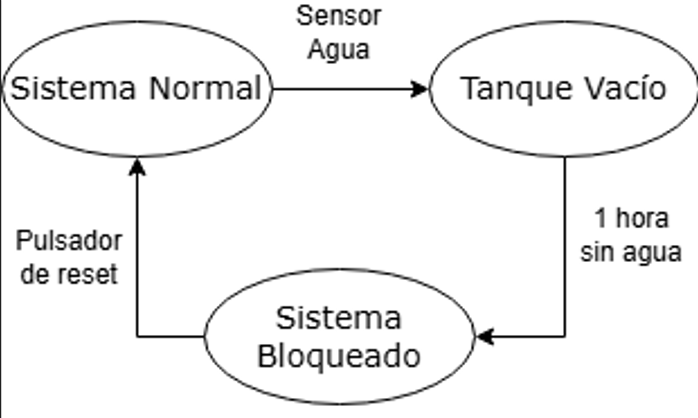
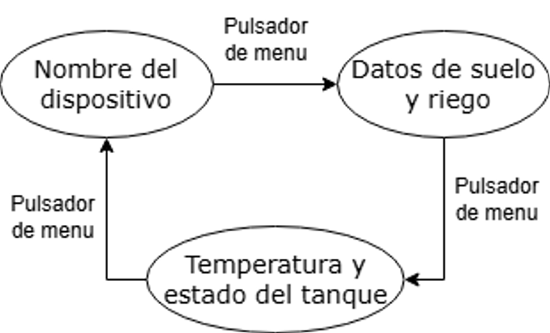
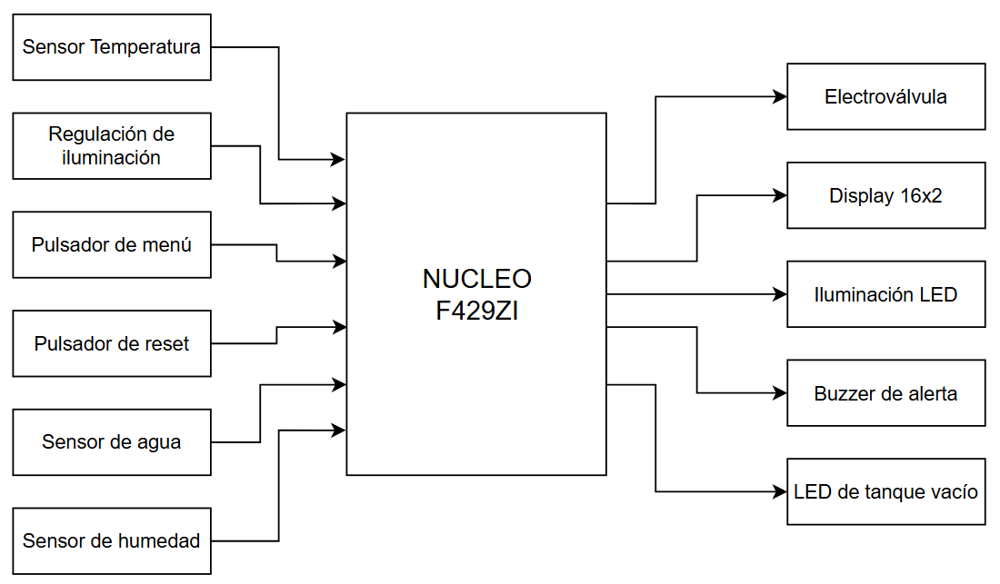

# TPN3_Monitoreo_Electrónico_de_Invernadero
El presente repositorio contiene la idea de proyecto correspondiente a la materia Sistemas Embebidos (86.65) a desarrollar en el TP3 durante el primer cuatrimestre del 2025

## Título:
Monitoreo Electrónico de Invernadero

## Alumno:
Wawryczuk Laureano Agustin (102400)

## Objetivo: 
Realizar un sistema automatico para mantener un entorno controlado para plantas y monitorear su desarrollo.

## Desarrollo:
El sistema de monitoreo del invernadero deberá medir temperatura ambiente y humedad del suelo para mantener este útlimo parámetro dentro de los requeridos por una planta específica. 
Apunta a plantas que requieren un cuidado especial y deberá ser autónomo, solo precisará la intervención del usuario ante agotamiento del agua dentro del reservorio y configuración inicial.
En la configuración inicial se deberá determinar el nivel de luz deseado para el correcto crecimiento de la planta controlado por PWM. Se utilizará un TIP122 conectado a una lámpara LED para controlar el nivel de iluminación del recinto con una lámpara acorde.
Si el sistema se queda sin agua, se encenderá un sistema de alerta mediante un LED. Si pasa 1 hora desde que el sistema se quedó sin agua entonces el sistema quedará bloqueado y encenderá un buzzer de alerta. Para poder desbloquearlo el usuario deberá presionar el botón de reset y llenar el tanque con agua. Estos estados se ilustran en la siguiente máquina de estados:

La cantidad de agua en el tanque, la temperatura, y la humedad del suelo serán enviados via UART a la computadora cada una hora para poder realizar el monitoreo remoto y obtener estadísticas.

Se agregó a este sistema un display LCD de 16x2 conectado por I2C que indicará diferentes parámetros en base al menú que se seleccione con el pulsador de Menu. El primer estado muestra el título "SISTEMA DE RIEGO AUTOMATICO", el segundo menú muestra el estado del suelo y de la electroválvula de riego, y el último menú muestra la temperatura y el estado del tanque. Esto se implementó con una segunda máquina de estados:

En caso de quedarse sin agua, el sistema encenderá un LED indicando que el sistema no tiene agua, sin embargo si luego de 1 hora no se recarga el agua en el tanque comenzará a sonar un buzzer, enviará un mensaje de alerta al display y otro a la computadora indicando que el sistema está bloqueado por falta de agua.

# Periféricos a utilizar:

-Sensor de Temperatura LM35

-Sensor de humedad del suelo anticorrosión 

-Electroválvula

-LED de alerta por falta de agua

-Buzzer

-Display LCD 16x2 con interfaz I2C

-Pulsador de Menú

-Pulsador de Reset

-Sensor de agua tipo ON/OFF

-TIP122 para control de lámpara
